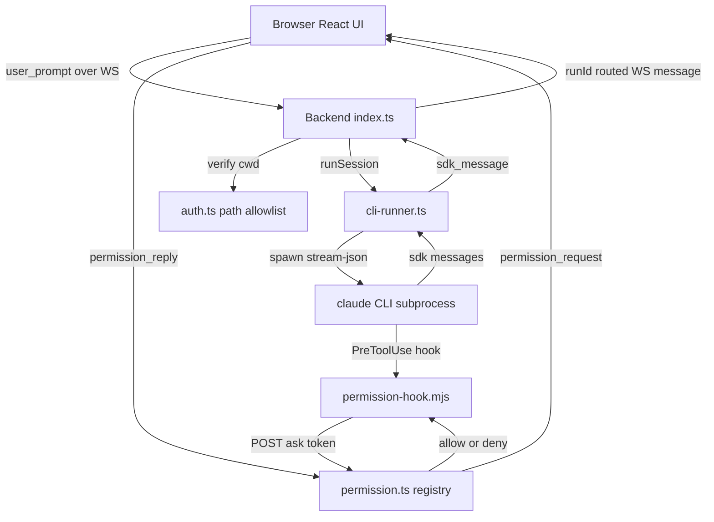

# 给后续 AI 的项目评估报告

这份报告给另一个 AI 使用，目标是让它能快速理解、复核并继续改进
`claude-web`。接手前必须同时阅读 [../CLAUDE.md](../CLAUDE.md)，那是当前项目最重要的架构说明和约束来源。

## 不可违反的约束

- 不要使用 `@anthropic-ai/claude-agent-sdk`。本项目故意通过本地
  `claude` CLI 子进程复用用户的 Claude Pro/Max 订阅。
- 不要运行 `claude --bare`。`--bare` 会强制走 API key 认证，破坏订阅认证路径。
- 前端请求后端接口时应继续使用相对路径，不要写死 `localhost:3030`，否则 Tailscale、反向代理和移动端部署会出问题。
- 把这个项目当作个人本机或 tailnet 工具。只要要暴露到更宽的网络边界，安全默认值就必须收紧。

## 项目快照

`claude-web` 是 pnpm monorepo，主要分三块：

- [../packages/backend](../packages/backend)：Hono HTTP 服务加 `ws` WebSocket 服务，默认端口 `3030`。同一个 origin 提供 `/api/*`、`/ws` 和前端生产构建产物。
- [../packages/frontend](../packages/frontend)：React 18、Vite、Zustand，以及适合手机使用的 Claude Web UI。前端通过一个复用的 WebSocket 和后端通信。
- [../packages/shared](../packages/shared)：前后端共享协议类型，包括 client/server message、model id、permission mode 和图片附件类型。

项目核心是“本地 `claude` CLI 的 Web 外壳”。每次用户发送 prompt，后端都会通过 [../packages/backend/src/cli-runner.ts](../packages/backend/src/cli-runner.ts) 启动一个 CLI 子进程，使用 stream-json 输入输出。后端逐行解析 CLI 输出的 JSON，再推给前端。

## 架构设计和目录结构评估

当前 `backend` / `frontend` / `shared` 三包分层是合理的，和项目体量匹配。这个项目的主要架构风险不是 monorepo 切分错误，而是少数文件开始承担太多职责，后续继续加功能时会变得难改。

当前目录结构：

```text
packages/
  backend/   Hono + ws，本机能力、CLI 子进程、API routes
  frontend/  React + Vite + Zustand，移动端 UI
  shared/    ClientMessage / ServerMessage 等协议类型
docs/        用户手册、改进清单、架构说明、AI 评估报告
```

结构上值得保留的点：

- `shared` 很克制，[../packages/shared/src/protocol.ts](../packages/shared/src/protocol.ts) 只放前后端协议类型，不承载业务逻辑。
- 后端 `routes/` 按领域拆出 `fs`、`git`、`voice`、`sessions`、`permission`，新增 API 时入口清楚。
- 前端有 `components/`、`hooks/`、`api/`，符合当前 React 项目规模。
- 后端服务前端 `dist` 是部署耦合，不是逻辑耦合；对单端口个人工具来说可以接受。

当前主要维护压力：

- [../packages/frontend/src/hooks/useVoice.ts](../packages/frontend/src/hooks/useVoice.ts) 约 1121 行，语音识别、TTS、设备枚举、对话模式、语音命令和状态编排都挤在一个 hook 里，是当前最大单点复杂度。
- [../packages/frontend/src/components/InputBox.tsx](../packages/frontend/src/components/InputBox.tsx) 约 544 行，输入 UI、附件、快捷指令和发送逻辑容易继续膨胀。
- [../packages/frontend/src/store.ts](../packages/frontend/src/store.ts) 约 489 行，项目、会话、权限、语音偏好、布局和用量统计都在一个 Zustand 文件里。
- [../packages/frontend/src/components/MessageItem.tsx](../packages/frontend/src/components/MessageItem.tsx) 约 393 行，消息类型继续增加后，渲染分支会越来越难维护。
- [../packages/backend/src/index.ts](../packages/backend/src/index.ts) 约 343 行，同时负责 Hono app、静态资源、gzip 缓存、WS upgrade 和 run 生命周期。
- [../packages/backend/src/routes/voice.ts](../packages/backend/src/routes/voice.ts) 约 348 行，把 HTTP handler、ffmpeg、whisper、edge-tts 和 cleanup 编排放在同一文件。

建议拆分方向：

```text
packages/frontend/src/voice/
  useVoice.ts
  speechRecognition.ts
  ttsQueue.ts
  devices.ts
  commands.ts
  cleanup.ts

packages/frontend/src/store/
  index.ts
  projectSlice.ts
  permissionSlice.ts
  layoutSlice.ts
  voiceSlice.ts
  usageSlice.ts

packages/backend/src/server/
  app.ts
  static-assets.ts
  websocket.ts
  health.ts
```

优先级建议：先拆 `useVoice.ts`，再拆 `store.ts` 和 `InputBox.tsx`，最后瘦身后端 `index.ts` 与 `voice.ts`。不要为了“目录更漂亮”重写架构；这些拆分只有在能降低现有文件复杂度时才值得做。

## 核心数据流



重要实现文件：

- [../packages/backend/src/index.ts](../packages/backend/src/index.ts)：Hono app、静态资源服务、WebSocket upgrade、活跃 run 跟踪、permission channel 注册和 `runId` 路由。
- [../packages/backend/src/auth.ts](../packages/backend/src/auth.ts)：Bearer/query token 鉴权和路径白名单。
- [../packages/backend/src/cli-runner.ts](../packages/backend/src/cli-runner.ts)：CLI 参数构造、子进程生命周期、stream-json 解析、stale session 重试、hook settings 注入和 abort 处理。
- [../packages/backend/src/routes/permission.ts](../packages/backend/src/routes/permission.ts)：PreToolUse hook 使用的 per-run permission registry。
- [../packages/frontend/src/ws-client.ts](../packages/frontend/src/ws-client.ts)：单 WebSocket 客户端、`runId` 到 cwd 的路由、权限回复、语音 sink 和重连逻辑。
- [../packages/frontend/src/store.ts](../packages/frontend/src/store.ts)：以 cwd 为 key 的 Zustand 状态中心。
- [../packages/shared/src/protocol.ts](../packages/shared/src/protocol.ts)：共享消息协议。改 WS 合同时优先改这里。

## 已经做得好的地方

- 架构边界清楚：后端负责本机能力，前端负责 UI 状态和呈现，`shared` 负责传输协议。
- 项目避开 Anthropic SDK，正确使用本地 `claude` CLI，保留订阅使用路径。
- 后端默认绑定 `127.0.0.1`，不是 `0.0.0.0`。
- 已经有 `CLAUDE_WEB_TOKEN` token 支持，以及 `CLAUDE_WEB_ALLOWED_ROOTS` 路径白名单。
- WebSocket upgrade 已经通过 [../packages/backend/src/auth.ts](../packages/backend/src/auth.ts) 做鉴权。
- CLI runner 有 stale session 恢复，并发送 `clear_run_messages`，让前端在重试前清掉本轮的部分输出。
- abort 处理会先发 SIGTERM，再在宽限期后升级到 SIGKILL。
- 权限请求可以携带 `runId` 路由，前端带上 run id 时后端不需要全量扫描。
- 后端会服务前端静态构建，并对可压缩资源做 gzip 缓存。
- 移动语音路径已经比较完整：STT、cleanup、TTS、重播、静音和 iOS PWA 行为都有考虑。
- 文档基础不错：[../CLAUDE.md](../CLAUDE.md)、[USER_MANUAL.md](USER_MANUAL.md)、[IDEAS.md](IDEAS.md)、[MOBILE_VOICE.md](MOBILE_VOICE.md) 都有实际价值。

## 主要风险

### 高：安全配置仍然是可选项

`CLAUDE_WEB_TOKEN` 和 `CLAUDE_WEB_ALLOWED_ROOTS` 目前是可选的。未设置时后端只告警，然后继续运行。这对本机开发方便，但如果服务被意外暴露到 `BACKEND_HOST=0.0.0.0`、Tailscale Funnel、公网 tunnel 或共享 tailnet，风险会很高。

建议方向：

- 增加生产或安全模式，例如 `CLAUDE_WEB_REQUIRE_SECURE_CONFIG=1`。
- 在该模式下，如果未配置 token 或路径白名单，后端直接拒绝启动。
- 本地开发可以继续保留当前宽松行为。

主要文件：

- [../packages/backend/src/index.ts](../packages/backend/src/index.ts)
- [../packages/backend/src/auth.ts](../packages/backend/src/auth.ts)
- [USER_MANUAL.md](USER_MANUAL.md)

### 高：权限链路存在 fail-open 场景

permission hook 和 route 为了避免 CLI 永久卡住，在多个场景会默认 allow，例如缺 token、会话不存在、payload 错误、等待超时。对个人工具可以理解，但它会削弱“工具执行需要显式确认”的用户预期。

建议方向：

- 增加环境变量开关，例如 `CLAUDE_WEB_PERMISSION_FAIL_CLOSED=1`。
- 在 fail-closed 模式下，缺 token、会话不存在、payload 错误和超时都返回 `deny`。
- 在 `/health` 或 `/api/auth/info` 暴露当前权限失败策略，让前端可以提示用户。

主要文件：

- [../packages/backend/src/routes/permission.ts](../packages/backend/src/routes/permission.ts)
- [../packages/backend/scripts/permission-hook.mjs](../packages/backend/scripts/permission-hook.mjs)
- [../packages/backend/src/cli-runner.ts](../packages/backend/src/cli-runner.ts)

### 中高：单共享 token 权限过大

一个共享 token 同时保护 HTTP API 和 WebSocket。WebSocket 还支持 `?token=...`，这很实用，但会扩大泄漏面，例如日志、浏览器历史、复制 URL、诊断信息。

建议方向：

- HTTP 继续优先用 Authorization header。
- query token 只保留给浏览器 WebSocket 这类确实需要的场景。
- 后续考虑设备级 token 或短期派生 token。
- 避免记录带 token query 的完整请求 URL。

主要文件：

- [../packages/backend/src/auth.ts](../packages/backend/src/auth.ts)
- [../packages/frontend/src/auth.ts](../packages/frontend/src/auth.ts)
- [../packages/frontend/src/ws-client.ts](../packages/frontend/src/ws-client.ts)

### 中：资源限额不完整

语音路由已有 body limit，但 WebSocket prompt、图片附件、单连接 run 数和请求频率还没有统一限额。一个异常浏览器 tab 或恶意客户端可以发大 payload，或启动过多 CLI 子进程。

建议方向：

- 限制 WS message 大小。
- 限制每次 prompt 的图片附件总字节数。
- 限制每个连接和全局活跃 run 数。
- 对 prompt 提交和昂贵语音接口加简单 rate limit。

主要文件：

- [../packages/backend/src/index.ts](../packages/backend/src/index.ts)
- [../packages/shared/src/protocol.ts](../packages/shared/src/protocol.ts)
- [../packages/backend/src/routes/voice.ts](../packages/backend/src/routes/voice.ts)

### 中：CORS 过宽

[../packages/backend/src/index.ts](../packages/backend/src/index.ts) 目前配置 `origin: "*"`。在 token 有效的前提下，任意网页都可以从浏览器上下文调用 API。这不是比缺认证更严重的问题，但会放大 token 泄漏后的影响。

建议方向：

- 开发环境继续允许 `origin: "*"`。
- 安全模式下限制为配置的前端 origin 或同源。

### 中低：没有 CI 门禁

后端有多个 `tsx` 测试脚本，但没有可见的 GitHub Actions workflow，也没有 repo 根目录的标准 `pnpm test` 门禁。auth、permission、CLI runner 这类关键路径容易被后续修改意外破坏。

建议方向：

- 引入 Vitest 这类常规测试框架。
- 第一批测试覆盖 auth 路径白名单、permission 超时、stale session 恢复和 session JSONL 归一化。
- 增加 GitHub Actions，跑 typecheck、build 和测试。

主要文件：

- [../package.json](../package.json)
- [../packages/backend/package.json](../packages/backend/package.json)
- [../packages/frontend/package.json](../packages/frontend/package.json)

### 低：SDK 内层消息类型过松

外层 WS 协议有类型，但 CLI SDK 内层消息大多按 `any` 处理。协议漂移时，编译期不容易发现问题。

建议方向：

- 先为实际渲染到 UI、usage 统计和语音使用到的 SDK message 建一个最小 discriminated union。
- 不要一开始就试图完整建模 Claude CLI 的所有事件。

主要文件：

- [../packages/shared/src/protocol.ts](../packages/shared/src/protocol.ts)
- [../packages/frontend/src/ws-client.ts](../packages/frontend/src/ws-client.ts)
- [../packages/frontend/src/components/MessageItem.tsx](../packages/frontend/src/components/MessageItem.tsx)

## `IMPROVEMENTS.md` 里的过期项

[IMPROVEMENTS.md](IMPROVEMENTS.md) 作为历史审计有用，但里面有些内容描述的是旧状态。不要不看现代码就照着实现。

当前代码里看起来已经处理过的事项：

- 共享 token auth 已存在于 [../packages/backend/src/auth.ts](../packages/backend/src/auth.ts)。
- WS upgrade auth 已存在于 [../packages/backend/src/index.ts](../packages/backend/src/index.ts)。
- 路径白名单已通过 `CLAUDE_WEB_ALLOWED_ROOTS` 实现。
- CLI abort 已在 [../packages/backend/src/cli-runner.ts](../packages/backend/src/cli-runner.ts) 中升级到 SIGKILL。
- permission request 已在 [../packages/backend/src/routes/permission.ts](../packages/backend/src/routes/permission.ts) 中设置长超时。
- permission reply 可在 [../packages/shared/src/protocol.ts](../packages/shared/src/protocol.ts) 中携带 `runId`。
- stale session 重试可以发出 `clear_run_messages`。
- TTS 错误会在 [../packages/backend/src/routes/voice.ts](../packages/backend/src/routes/voice.ts) 中记录并返回错误信息。
- `CLAUDE.md` 已存在，并且是正确的高层项目指南。

建议处理：

- 把 [IMPROVEMENTS.md](IMPROVEMENTS.md) 从旧审计快照改成当前 backlog。
- 已完成项标记为 done，或移动到历史区。
- 保留这份报告里的当前风险排序，或重新复核后替换。

## 建议执行路线

### 短期

1. 增加安全启动模式。
   - 文件：[../packages/backend/src/index.ts](../packages/backend/src/index.ts)、[../packages/backend/src/auth.ts](../packages/backend/src/auth.ts)。
   - 结果：安全模式启用时，缺 token 或缺 allowed roots 会快速失败，而不是只打印告警。

2. 增加可配置的权限失败策略。
   - 文件：[../packages/backend/src/routes/permission.ts](../packages/backend/src/routes/permission.ts)、[../packages/backend/scripts/permission-hook.mjs](../packages/backend/scripts/permission-hook.mjs)。
   - 结果：本地开发可继续 fail-open，部署模式可 fail-closed。

3. 增加 WebSocket 和附件限额。
   - 文件：[../packages/backend/src/index.ts](../packages/backend/src/index.ts)、[../packages/shared/src/protocol.ts](../packages/shared/src/protocol.ts)。
   - 结果：大 payload 或滥用请求会在启动 CLI 前被拒绝。

4. 刷新文档。
   - 文件：[IMPROVEMENTS.md](IMPROVEMENTS.md)、[USER_MANUAL.md](USER_MANUAL.md)，如果新增环境变量，也更新 [../CLAUDE.md](../CLAUDE.md)。
   - 结果：后续 AI 不会重复处理已经修过的问题。

### 中期

1. 增加 Vitest 和 CI。
   - 先覆盖 `auth.ts`、`permission.ts`、`cli-runner.ts`、`sessions.ts`。
   - CI 跑前端 build 和 typecheck。

2. 改进 token 模型。
   - 支持设备级 token 或短期派生 token。
   - 尽量减少长期共享 secret 出现在 URL 里。

3. 收紧消息类型。
   - 为渲染、usage 统计和语音实际使用的 SDK message 建模。
   - 先替换最宽泛、最容易出错的 `any` 路径。

4. 增加运行可观测性。
   - 扩展 `/health`，返回 active run 数、permission 策略、安全配置状态、外部工具可用性。

5. 拆分过大的前端和后端模块。
   - 优先拆 [../packages/frontend/src/hooks/useVoice.ts](../packages/frontend/src/hooks/useVoice.ts)，再拆 [../packages/frontend/src/store.ts](../packages/frontend/src/store.ts)、[../packages/frontend/src/components/InputBox.tsx](../packages/frontend/src/components/InputBox.tsx)。
   - 后端优先把 [../packages/backend/src/index.ts](../packages/backend/src/index.ts) 的静态资源服务和 WebSocket 编排拆到 `server/` 子模块。
   - 目标是降低文件职责密度，不改变 `backend` / `frontend` / `shared` 的整体分层。

## 给后续 AI 的复核清单

动手改代码前，直接从代码核对这些点：

- [../packages/backend/src/auth.ts](../packages/backend/src/auth.ts) 是否仍允许空 token 和空 allowed roots？
- [../packages/backend/src/index.ts](../packages/backend/src/index.ts) 是否仍默认绑定 `127.0.0.1`？
- [../packages/backend/src/routes/permission.ts](../packages/backend/src/routes/permission.ts) 是否仍在缺 token、会话不存在、payload 错误或超时时返回 `allow`？
- [../packages/frontend/src/ws-client.ts](../packages/frontend/src/ws-client.ts) 是否仍通过 `withAuthQuery` 给 WebSocket 连接传 token？
- 图片附件是否仍会在没有显式总大小限制的情况下传到 [../packages/backend/src/cli-runner.ts](../packages/backend/src/cli-runner.ts)？
- 是否仍没有 `.github/workflows` 目录？
- [../packages/frontend/src/hooks/useVoice.ts](../packages/frontend/src/hooks/useVoice.ts)、[../packages/frontend/src/store.ts](../packages/frontend/src/store.ts)、[../packages/backend/src/index.ts](../packages/backend/src/index.ts) 是否仍是主要复杂度集中点？
- [IMPROVEMENTS.md](IMPROVEMENTS.md) 是否已经在这份报告之后被更新？

## 给后续 AI 的实际建议

保持改动小而贴合现有架构。这个项目不是通用多用户 SaaS，而是本地 Claude CLI 的个人 Web 外壳。优先加不破坏简单性的护栏。

第一批最值得做：

1. 安全启动环境变量。
2. permission fail-closed 环境变量。
3. WS payload 和附件限额。
4. 文档更新。
5. 针对上述行为的聚焦测试。

除非用户明确要求做多用户产品或企业部署模型，否则不要做大范围重写。
