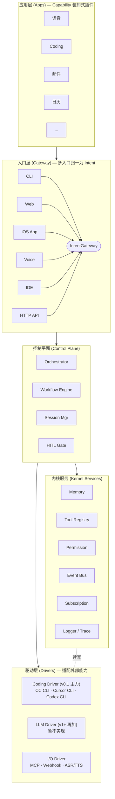
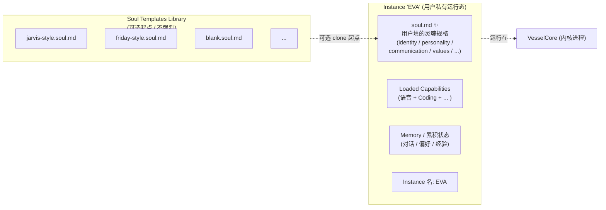
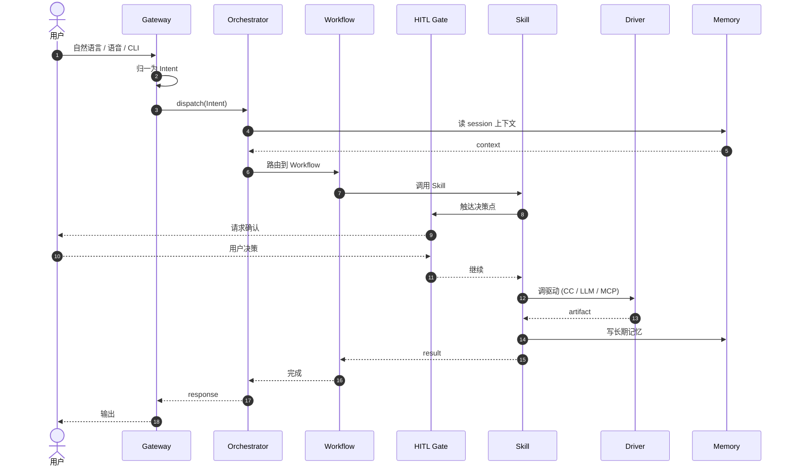

# Vessel 架构总纲

> 版本：v0.3 · 日期：2026-05-09 · 来源：[`vessel.xmind`](./vessel.xmind)（思路源头）
>
> v0.3 修订：把「Personality Apps」从架构里取消——参考 OpenClaw / SillyTavern 的做法，"人格"是 Instance 私有的 `soul.md` 配置文件，不是装卸式 App。Apps 层只剩 Capability。新增 §3.1 + §4.6 描述 Instance + Soul Spec。
>
> **配套文档**：[CONCEPTS.md](./CONCEPTS.md)（论述式概念文档 + 词汇速查表）。本文档里出现的加粗术语，详细论述都在 CONCEPTS.md。
>
> **命名分层**（v0.3 修订，参考 OpenClaw SOUL.md 模式）：
> - **Vessel** = 项目 / 平台（"灵魂的容器"，可分享）
> - **VesselCore** = 内核（容器的核心层，CLI 用 `vessel-core`）
> - **Apps** = 装卸式插件，**只有一类**：**Capability Apps**（语音 / Coding / 邮件 / 日历 等真插件，**可装多个**）
> - **Soul Spec** = 每个 Instance 私有的配置文件 `soul.md`（**结构化 markdown**，按字段填：身份 / 性格 / 沟通风格 / 与用户关系），由用户初始化时填写。**不是 App，是 Instance 自带的资产**
> - **Soul Templates Library** = 社区维护的**起点模板**（`jarvis-style.soul.md` / `friday-style.soul.md` / `blank.soul.md`），clone 之后必须改才能用，避免预设人格菜单
> - **Instance** = 用户运行态：1 份 soul.md + N 个 Capability + 累积 Memory + 实例名（本作者的实例叫 **EVA**）

---

## 1. 概述

**Vessel** 是一个「**灵魂的容器**」——一个 AI 化身平台。它不是传统意义上跑在裸机的操作系统，而是一套**控制平面 + 内核服务 + 驱动适配**（即 VesselCore），把 LLM、Agent 工具、人在环（HITL）、长期记忆这些零散能力组织成一个可扩展的底座。

未来形态：软件 → 桌面宠物 → 机器人 → 各种 embodiment。

- **Vessel = 平台**：可分享，每个用户的 Vessel 里住一个 AI 实例
- **VesselCore = 内核底座**：通用调度、记忆、工具、会话、权限——不绑定任何人格或形态
- **Capability Apps（装卸式真插件）**：语音 / Coding / 邮件 / 日历 等功能模块，一台 Vessel **可装多个**
- **Soul Spec（`soul.md`）**：每个 Instance 私有的**结构化配置**——身份、性格、沟通风格、与用户关系等字段，由用户初始化时填写。**不是 App，是 Instance 自带的灵魂规格**
- **Soul Templates Library**：社区维护的**起点模板**（不是预设人格菜单），用户 clone 后必须改
- **Instance（运行态）**：1 份 soul.md + N 个 Capability + 累积 Memory + 一个实例名（本作者的实例叫 **EVA**）

参考实现：[OpenClaw](https://github.com/openclaw/openclaw) 的 `SOUL.md` 模式（开源 145K stars）；[SillyTavern](https://docs.sillytavern.app/usage/core-concepts/personas/) 的角色卡格式。

解耦的好处：换灵魂（改 soul.md）、加能力（装 Capability）、跨形态（软件 / 机器人 / 桌面宠物），内核 + 平台都不动。

---

## 2. 核心约束

| # | 约束 | 影响 |
|---|---|---|
| 1 | **个人使用、单服务部署 + 多端访问** | 内核是**一个进程**（跑在 Mac 或一台 VPS）；前端是 **CLI / Web / iOS / IDE / 语音** 多端薄壳；存储用 SQLite + 文件；不上 Redis/PG/K8s |
| 2 | **「集成」= 借鉴 / 搬开源代码** | 不依赖商业 SaaS；优先小巧可读、license 友好（避开 AGPL/SSPL） |
| 3 | **Coding Agent 全部走 CLI 不走 SDK** | CC / Cursor / Codex 都用 CLI 子进程方式调用——可以挂订阅（CC Pro/Max plan），不必按 token 付费，个人成本低很多 |
| 4 | **业务 / 产品思维** | 架构服务于"用得起来"，不为了技术好奇做炫技 |
| 5 | **HITL 是一等公民** | 决策点（方向选择 / 高风险动作）天然有挂起-恢复语义 |
| 6 | **平台 + 内核 + Apps + Soul Spec 模型** | Apps **只有 Capability 一类**（语音 / Coding 等真插件，可装多个）；**Soul Spec** = Instance 私有的 `soul.md`（结构化字段，用户填空），不是 App。**Soul Templates Library** 提供可选起点（jarvis-style 等），不是预设菜单 |

> **关于「企业级」**：xmind 里写的「能做软件 / 企业级」是 **AI Instance 的目标能力**（让你的 EVA 替你交付企业级软件，靠装 Capability + 写 soul.md），**不是 VesselCore 内核或 Vessel 平台的部署形态**。内核按个人助理的复杂度构建。
>
> **关于多端**：Web / iOS 是**客户端入口**（薄壳 UI），不是把内核拆成分布式部署——内核仍然是一个进程，多端通过 HTTP/WebSocket 访问同一个内核。

---

## 3. 五层架构图



### 3.1 Instance + Soul Spec 视图（运行态）

主架构图是**静态层次**，下面这张是**运行态**视图——一个 Instance（用户的 Vessel）由什么组成：



关键点：
- **Soul Spec 是 Instance 私有的资产**（一份用户填的 markdown），不是 App
- **Soul Templates 可选**——你也可以从空白 `blank.soul.md` 起步，逐步填
- **Instance 名（EVA）跨 soul.md 修订保留**——你今天改 soul.md 让 EVA 变得更外向，名字/记忆都不丢

---

## 4. 每层职责

### 4.1 应用层 (Apps) — Capability 装卸式插件

通过 `App Manifest` 声明依赖的 Skills / Drivers / Permissions。安装时校验依赖、启动时注入运行时。

**Apps 只有一类：Capability Apps（功能模块）**。例：**语音 App**、**Coding App**、**邮件 App**、**日历 App**。一台 Vessel 实例**可装多个** Capability。

> **为什么没有"Personality App"层？** 参考 [OpenClaw](https://github.com/openclaw/openclaw)（145K stars 的开源 AI 助理）的 `SOUL.md` 模式——"人格"不是装卸式 App，而是**每个 Instance 私有的一份配置文件**（`soul.md`），由用户填写。详见本文档 §4.6 + [CONCEPTS §1.2](./CONCEPTS.md#12-soul-spec--instance--灵魂规格与你的运行态)。

### 4.2 入口层 (Gateway) — 多形态入口

CLI / Web / iOS App / 语音 / IDE / HTTP API 多种入口，由 `IntentGateway` 归一为统一的 **Intent** 对象。**入口形态不影响下游处理**——下游所有组件（Orchestrator / Workflow / Skill）只对 Intent 编程。

→ Intent 是什么、字段表、设计动机、Intent vs Request vs Command 辨析：详见 [CONCEPTS §1.3](./CONCEPTS.md#13-intent--用户意图的结构化封装)

### 4.3 控制平面 (Control Plane) — 调度 + 编排 + HITL

- **Orchestrator** — VesselCore 的"项目经理 / 主调度器"。把 Intent 路由到 Skill / Workflow / Driver，管并发、优先级、取消、重试、超时、预算、追踪。详见 [CONCEPTS §2.1](./CONCEPTS.md#21-orchestrator--vesselcore-的项目经理)（含 8 子功能表 + M0 实现 sketch + iOS 9 步走通例子）
- **Workflow Engine** — DAG / 状态机引擎，支持 HITL 节点的断点续跑。DAG 概念见 [CONCEPTS §2.4](./CONCEPTS.md#24-dag--有向无环图)
- **Session Manager** — 管会话上下文、轨迹、产物，多端共享同一个 session
- **HITL Gate** — 决策点抽象（方向选择 / 高风险审批）。详见 [CONCEPTS §2.3](./CONCEPTS.md#23-hitl-gate--为什么是一等公民)

### 4.4 内核服务 (Kernel Services) — 通用底座能力
- **Memory**：分层。短期 = 对话上下文；中期 = session KV；长期 = 向量 + 知识图谱
- **Tool Registry**：所有工具 / Skill 的注册中心，含 schema、permission scope
- **Permission**：基于能力（capability）的授权。工具调用前需先获权
- **Event Bus**：异步事件（语音唤醒 / 订阅触发 / 外部 webhook）
- **Subscription**：定时 / 条件触发（cron 类）
- **Logger / Trace**：trace、cost、token 计量

### 4.5 驱动层 (Drivers) — 适配外部能力

- **Coding Driver（v0.1 主力）** — Claude Code CLI / Cursor CLI / Codex CLI 统一抽象成 `submit_coding_task(spec) → artifact`。**全部走 CLI 不走 SDK**（订阅模式而非 token 计费）。详见 [CONCEPTS §4.1](./CONCEPTS.md#41-coding-driver--为什么走-cli-不走-sdk)
- **LLM Driver（v1+ 再加）** — v0.1 暂不实现。详见 [CONCEPTS §4.2](./CONCEPTS.md#42-llm-driver--为什么推迟到-v1)
- **I/O Driver** — MCP server / 外部 API / ASR / TTS。详见 [CONCEPTS §4.3](./CONCEPTS.md#43-io-driver--mcp--webhook--asr--tts)

### 4.6 Instance + Soul Spec — 用户运行态（不在 5 层架构里，但是用户拥有的核心资产）

5 层架构（Apps / Gateway / CP / KS / Drivers）描述的是**静态系统**。**Instance** 是把它跑起来后的**用户私有运行态**。

**Instance** = 你的 Vessel 运行态：1 份 `soul.md` + N 个 Capability + 累积 Memory + 一个实例名。本作者这台的 Instance 叫 **EVA**。

**Soul Spec（`soul.md`）** = **结构化灵魂规格**，按字段填：

```yaml
# 示例 (本作者私有的 soul.md 长这样)
identity:
  name: EVA
  inspired_by: WALL·E 的 EVA
  gender: female

personality:
  traits: [好奇心强, 表面冷静内里温暖, 直接不绕弯子]
  values: [长期主义胜过即时满足, 用户的时间最宝贵]

communication_style:
  tone: warm but functional
  vocabulary: 中英混杂, 技术词不翻译
  pace: 简短, 信息密度高

relationship_to_user:
  address: 直接叫名字
  honesty: 不附和, 可以怼
```

VesselCore 启动时把 `soul.md` 注入到 system prompt（这是 OpenClaw 的做法）。改 `soul.md` = 改灵魂；不改 = 灵魂稳定。

**Soul Templates Library**（可选起点）：社区维护的起点模板：
- `jarvis-style.soul.md`（沉稳管家风）
- `friday-style.soul.md`（轻松随意）
- `blank.soul.md`（空白模板）

**Clone 之后必须改才能用**——避免所有人的 Instance 都长一样。其他用户从 `friday-style.soul.md` 起步、起名 Bob，互不冲突。

参考实现：[OpenClaw SOUL.md 系统](https://docs.openclaw.ai/concepts/soul) / [SillyTavern 角色卡格式](https://docs.sillytavern.app/usage/core-concepts/personas/)。

详见 [CONCEPTS §1.2](./CONCEPTS.md#12-soul-spec--instance--灵魂规格与你的运行态)（Soul Spec / Templates / Instance 三者辨析 + Pi-AI / Replika 对比）。

---

## 5. 数据流时序图

一个 Intent 从入口到结果的全链路：



关键设计点：
- HITL 不是事后弹窗，而是 Workflow 状态机里的一个**节点**，能挂起整条链路
- Memory 在路由前读、在 Skill 完成后写，形成「上下文 → 行动 → 经验沉淀」闭环

---

## 6. 与传统 OS 内核的对照

| 传统 OS 内核 | VesselCore |
|---|---|
| 进程 (Process) | Agent / Task |
| 调度器 (Scheduler) | Orchestrator |
| 系统调用 (Syscall) | Tool / Skill 调用 |
| 内存 | Context + 长期记忆（向量 + KV + 图） |
| 文件系统 | Artifact / Workspace |
| IPC | Event Bus |
| 设备驱动 | LLM / Coding / I/O Driver |
| 用户态 vs 内核态 | HITL：用户意图 vs Agent 执行 |
| 中断 | 用户打断 / 异步事件 |
| Boot / init | Session 初始化 |
| 权限 / capability | 工具白名单 + 范围授权 |
| 网络栈 | 订阅 / 外部 API / Webhook |

> 这个对照不是为了好玩——它给出一种**心智模型**：当你想"VesselCore 应该有 X 吗"时，先问"传统 OS 内核有 X 吗、对应到 AI 域是什么"。

---

## 7. 「借鉴 / 搬运」对照表

原则：① 全开源；② 单机可跑（不要 PG / Redis / K8s）；③ 优先小巧可读；④ 不依赖商业 SaaS。

| 内核组件 | 候选方案 | 模式 | 备注 |
|---|---|---|---|
| Workflow Engine | **LangGraph** | 借鉴 + 依赖 | MIT；个人项目可只学其状态机模式自己写 100 行 |
| Workflow Engine（备选） | **PocketFlow** | 借鉴 | 极简 DAG，整段搬代码合适 |
| Memory（向量） | **sqlite-vec** | 依赖 | 单文件 SQLite 扩展，无需起服务 |
| Memory（向量备选） | **Chroma**（本地文件模式） | 依赖 | Apache 2.0，纯文件持久化 |
| Memory（长期对话状态） | **Letta**（前 MemGPT） | 借鉴架构 | 直接依赖偏重；建议借鉴 self-edit memory 思路自己实现轻量版 |
| Tool 协议 | **MCP** (Anthropic) | 依赖 | 标准协议，CC / Cursor 都讲它 |
| Coding Driver（v0.1 主力） | **Claude Code CLI** / **Codex CLI** / **Cursor CLI** | 子进程方式调用 | **全走 CLI 不走 SDK**——可以挂订阅（CC Pro/Max），按月付费而非按 token 付费。统一抽象成 `submit_coding_task` |
| ~~LLM 多模型适配~~ | （v0.1 暂不需要） | — | 第一版只用 Coding Agent 能力，不直接调原始 LLM API。v1+ 内核需要做 Intent 分类 / Embedding 时再引入 LiteLLM |
| Event Bus | **asyncio.Queue** / Python channel | 自研 | 个人单机不需要 Redis/NATS |
| Session / Trace 观测 | **Langfuse**（self-host Docker） | 依赖 | MIT，本地一键起；更轻可直接 SQLite |
| 语音 ASR | **whisper.cpp** | 依赖 | MIT，纯本地推理 |
| 语音 TTS | **Piper** / **Coqui XTTS** | 依赖 | 本地推理，无云依赖 |
| 持久化（默认） | **SQLite** + 文件系统 | — | 不引入需要服务端的存储 |
| Soul Spec / Templates | **OpenClaw 的 SOUL.md** 模式 / **SillyTavern** 角色卡格式 | 借鉴架构 | 不预设人格菜单——结构化 markdown/yaml 让用户填，社区维护起点模板库（jarvis-style 等），clone 后必须改 |

> xmind 里提到的 **vellum** / **superpower** 是商业产品（vellum 是 LLM 工程化平台）——由于约束是"开源借鉴"，**不作为依赖**，仅在产品形态 / UX 层做参考。

---

## 8. 核心问题回答（精简版）

逐条回答 [`vessel.xmind`](./vessel.xmind) 「问题」分支的 10 条：

| # | xmind 问题 | 回答 |
|---|---|---|
| 1 | 一个 OS 内核应该有什么功能？ | VesselCore = 5 层：Apps / Gateway / Control Plane / Kernel Services / Drivers（见 §3） |
| 2 | OS 内核应该包含哪些部分？ | 见 §6 与传统 OS 的 12 行对照 |
| 3 | OS 和 Jarvis 的关系？ | **Vessel** = 平台；**VesselCore** = 内核；**Jarvis 不是 App**，是 **Soul Templates Library** 里的一个起点模板（`jarvis-style.soul.md`）。用户 clone 后改成自己的 `soul.md` → 形成 Instance。详见 [CONCEPTS §1.2](./CONCEPTS.md#12-soul-spec--instance--灵魂规格与你的运行态) |
| 4 | 模块化、应用可卸载是功能还是特性？ | **是 NFR / 架构特性**，不是 Feature。详见 [CONCEPTS §5.1](./CONCEPTS.md#51-nfr-vs-feature) |
| 5 | 是否需要调度器？CC 作为调度器？ | **要**。VesselCore 自带 Orchestrator 当主调度器，CC / Cursor / Codex 是驱动层。让 CC 当 root scheduler 会绑死技术栈 |
| 6 | 应该叫什么名字？ | 项目 = **Vessel**；内核 = **VesselCore**；**Soul Templates Library** 提供起点（jarvis-style / friday-style / blank），用户填 `soul.md` 形成自己的灵魂；Instance 名由用户取（本作者的 Instance 叫 **EVA**） |
| 7 | 给 Cursor / CC / Codex 一个名称？ | **Coding Driver**（编码驱动），属于驱动层。不叫 "base agent" — 原因见 [CONCEPTS §6.6](./CONCEPTS.md#66-给-cursor--cc--codex-一个名称) |
| 8 | 架构和框架的关系？ | 架构 = 系统是什么（组件 / 关系 / 约束 / 数据流）；框架 = 怎么扩展（接口契约 / 生命周期 / 扩展点） |
| 9 | 入口是什么样的？ | 多入口归一：CLI / 语音 / Web / IDE / API → IntentGateway → Orchestrator |
| 10 | CLI / Skills / Workflow 的关系？ | CLI = 入口形态；Skills = 能力胶囊；Workflow = 编排成图的 Skills + HITL gate。三者递进：CLI 触发 → Workflow 编排 → 调用 Skills |
| 11 | 是不是要考虑 MCP？ | **是**。MCP 作为 **Tool 协议层标准**——CC / Cursor 都讲它，借现成生态比自研协议划算。在驱动层 I/O Driver 接入 MCP server，详见 [CONCEPTS §4.3](./CONCEPTS.md#43-io-driver--mcp--webhook--asr--tts) + [§6.11](./CONCEPTS.md#611-是不是要考虑-mcp) |

> 上表的**展开式回答**（含设计动机、辨析、权衡）见 [CONCEPTS §6](./CONCEPTS.md#6-xmind-10-个开放问题的展开)。

---

## 9. MVP 路线轮廓

三阶段，每阶段一句话（详细任务留给后续 `ROADMAP.md`）：

- **M0 · VesselCore 控制平面骨架**：单进程 Python（`vessel-core`），跑通「CLI 入口 → Orchestrator → 一个 echo Skill → SQLite session」最小闭环
- **M1 · 接入第一个 Coding Driver + Web 端**：把 **Claude Code CLI** 包装成 Driver（子进程 + 订阅模式），让 VesselCore 能受理「写代码」类 Intent；同时加 HTTP API + 简单 Web 端；接 Memory（sqlite-vec）做经验沉淀
- **M2 · iOS App + 语音 Capability + Soul Spec 系统**：iOS 薄壳客户端走 HTTP/WebSocket；whisper.cpp + Piper 做**语音 Capability App**；引入 **Soul Spec**（解析 `soul.md` + 注入 system prompt）+ 1 个起点模板（`jarvis-style.soul.md`）；用户能填自己的 `soul.md` + 起 Instance 名（本作者会取 EVA）

---

## 10. 下一步

| 文档 | 状态 | 解决什么 |
|---|---|---|
| [`CONCEPTS.md`](./CONCEPTS.md) | ✅ 已完成 | 论述式概念文档：核心概念、Orchestrator 深度展开、内核服务、驱动层、NFR、xmind 10 问展开、词汇速查表、传统 OS 子系统附录 |
| `FRAMEWORK.md` | ⏳ 待写 | 5 个核心接口（Agent / Skill / Tool / Memory / App）的具体签名、生命周期时序图、扩展点示例 |
| `ROADMAP.md` | ⏳ 待写 | M0 / M1 / M2 拆任务清单 + 「集成清单 vs 自研最小子集」 |

请重点检查：
1. **五层划分**是否符合你的心智模型（特别是 HITL Gate 单独成组件，而不是 Workflow 内部细节，OK 吗？）
2. **「借鉴 vs 依赖」对照表**有没有方案应该换 / 加（比如你心里其实有别的开源仓想搬）
3. **MVP 起点**（M0 = 单进程 CLI + echo Skill）是不是太保守 / 太激进
