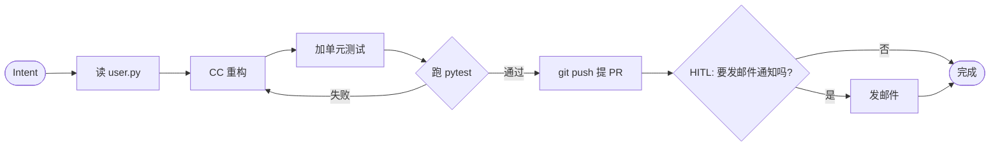

# Vessel 概念文档

> 配套：[ARCHITECTURE.md](./ARCHITECTURE.md)（架构总纲） · [vessel.xmind](./vessel.xmind)（思路源头）
>
> **本文档是论述式**——解释「为什么这么设计、概念怎么辨析、有哪些设计权衡」。要快速查名词定义，跳到末尾的 [§7 词汇速查表](#7-词汇速查表)。
>
> **命名分层（v0.3 修订）**：
> - **Vessel**（项目 / 平台）→ **VesselCore**（内核）→ **Capability Apps**（装卸式真插件，可装多个）
> - **Soul Spec** = Instance 私有的 `soul.md`（结构化字段，用户填空）；不是 App
> - **Soul Templates Library** = 社区起点模板（不是预设人格菜单）
> - **Instance**（用户运行态，本作者的 Instance 名叫 **EVA**）= 1 份 soul.md + N 个 Capability + Memory + 名字
>
> v0.3 修订动机：参考 [OpenClaw](https://github.com/openclaw/openclaw) 的 SOUL.md 模式 + [SillyTavern](https://docs.sillytavern.app/) 的角色卡格式——"人格"不是装卸式 App 菜单，而是用户填的配置文件。

## 怎么读这份文档

- **按章节读** = 学习 Vessel 的设计哲学
- **按词查** = 跳尾巴的速查表，每条术语 1–3 行 + 跳回详细论述
- ARCHITECTURE.md 里出现的加粗术语，几乎都在这里有详细论述

---

## 1. 核心概念

### 1.1 Vessel + VesselCore — 灵魂的容器及其内核

**Vessel（项目 / 平台层）**：一个 AI 化身平台，可分享给别人。每个用户的 Vessel 里住一个 AI 实例。未来支持软件 / 桌面宠物 / 机器人等多种 embodiment 形态。

**VesselCore（内核层）**：Vessel 的核心进程，承担调度 / 记忆 / 工具 / 会话 / 权限等通用底座能力。CLI 命令名 `vessel-core`。

**为什么不是传统 OS**：传统 OS 跑在裸机上，调度的是进程；VesselCore 跑在普通 OS 之上，调度的是 Agent 任务、上下文、工具调用。VesselCore 借用 OS 的**心智模型**（调度器、IPC、驱动、权限），但实现完全不同。

**为什么把 Vessel / VesselCore / Apps / Soul / Instance 拆开**：
- **VesselCore（内核）**只提供通用能力，不绑定任何人格或形态
- **Capability Apps**（装卸式真插件）提供功能模块（语音 / Coding / 邮件等）
- **Soul Spec**（Instance 私有的 `soul.md`）定义灵魂——这是用户填的配置文件，**不是 App**
- **Instance**（用户运行态）= soul.md + 装载的 Capabilities + 累积 Memory + 实例名
- 换灵魂（改 soul.md）、加能力（装 Capability）、跨形态（软件 / 机器人 / 宠物），内核都不动

**与「AI 框架」的区别**：LangChain / LangGraph / AutoGen 是**框架**——你的代码调用它的 API。Vessel 是**平台**——它常驻运行，多端访问，多 App 共存，多 Session 并发。

---

### 1.2 Soul Spec / Instance — 灵魂规格与你的运行态

**Soul Spec（`soul.md`）**：每个 Instance 私有的**结构化配置文件**——不是预设人格菜单，是按字段让用户填的灵魂规格。参考 [OpenClaw 的 SOUL.md 系统](https://docs.openclaw.ai/concepts/soul)（145K stars 开源 AI 助理）。

字段示例（YAML / Markdown 任选）：

```yaml
identity:
  name: EVA
  inspired_by: WALL·E 的 EVA
  gender: female

personality:
  traits: [好奇心强, 表面冷静内里温暖, 直接不绕弯子]
  values: [长期主义胜过即时满足, 用户的时间最宝贵]

communication_style:
  tone: warm but functional
  vocabulary: 中英混杂, 技术词不翻译
  pace: 简短, 信息密度高

relationship_to_user:
  address: 直接叫名字
  honesty: 不附和, 可以怼
```

VesselCore 启动时把 `soul.md` 注入到 system prompt——这就是 OpenClaw 的"读自己 into being"模式。

**Soul Templates Library（可选起点）**：社区维护的起点模板——**不是预设人格菜单**。例：

- `jarvis-style.soul.md`（沉稳管家起点）
- `friday-style.soul.md`（轻松随意起点）
- `butler-style.soul.md`（极致礼貌起点）
- `blank.soul.md`（空白模板，从零开始）

**Clone 之后必须改才能用**——这是设计上的强制规定，避免所有人的 Instance 都长一样。

**Instance（实例）**：你的 Vessel 运行态——一份 `soul.md` + N 个 Capability + 累积 Memory + 一个实例名。本作者这台的 Instance 叫 **EVA**（来自《WALL·E》里那个找生命的女主机器人）。

**Soul Spec / Soul Template / Instance 三者辨析**：

| 概念 | 是什么 | 谁拥有 | 数量 |
|---|---|---|---|
| **Soul Template** | 社区共享的起点模板（jarvis-style.soul.md 等） | 公共 / 开源 | 多个，社区贡献 |
| **Soul Spec** | 你自己填好的 `soul.md`（独一无二） | Instance 私有 | 1 份/Instance |
| **Instance** | 你的整台 Vessel 运行态（名 + soul + caps + memory） | 你 | 1 个/用户 |

调用关系：（可选）从 Template clone 起步 → 编辑成你的 Soul Spec → Instance 装载它。

**和 Pi by Inflection 的对比**（反例）：

Pi 的人格是**单一固定**的（Inflection 自己设计），用户只能选 8 种语音预设 + 改 Pi 称呼自己的名字。**Pi 的"个性"用户改不了主结构**。
- ❌ Pi 模式 = 固定人格 + 少量配置
- ✅ Vessel 模式 = 用户填的结构化 soul.md（参考 OpenClaw / SillyTavern 角色卡）

**关键点**：
- Soul Spec 是 Instance **私有的资产**，不是装卸式 App
- 改 `soul.md` = 灵魂演化；不改 = 灵魂稳定
- Instance 名（EVA）跨 soul.md 修订保留——你今天调整 EVA 的语气更外向，名字 + 累积 Memory 都不丢
- 其他用户从 `friday-style.soul.md` 起步、起名 Bob，互不冲突

**Soul Spec vs Capability App vs Instance vs Agent 的辨析**（最容易混）：
- **Capability App** = 装卸式真插件（语音 / Coding 等代码包）
- **Soul Spec** = 你 Instance 私有的 markdown 配置（人格规格）
- **Instance** = 你的运行态（soul + caps + memory + 名字 = 一整台你的 Vessel）
- **Agent** = 一次具体任务的执行（Instance 接到 Intent 后启一个 Agent 去跑）

---

### 1.3 Intent — 用户意图的结构化封装

**一句话**：把「自然语言诉求 + 上下文环境 + 来源渠道」打包成一个对象，让下游不用关心来源。

**为什么需要 Intent**（反证法）：

如果没有 Intent，每个 Skill / Workflow 都要直接处理「用户从哪来、说了什么、有没有附件」。每加一个入口（iOS / Web / 语音）下游全要改。Intent 是一层**入口/逻辑解耦**。

**字段**：

| 字段 | 含义 | 例 |
|---|---|---|
| `text` | 用户原始自然语言 | "帮我把昨天那个 PR 加上单元测试" |
| `source` | 入口通道 | `cli` / `web` / `ios` / `voice` / `ide` / `api` |
| `user_id` | 用户身份 | `albertsun` |
| `session_id` | 会话 ID | `sess_2026-05-08_xxx` |
| `attachments` | 附件 | 图片 / 代码片段 / 文件路径 |
| `priority` | 优先级提示 | `normal` / `urgent` / `background` |
| `created_at` | 时间戳 | — |

**Intent vs Request vs Command（辨析）**：
- HTTP **Request** = 网络层 / 协议层概念，含 method / URL / headers / body
- **Command** = 动作层概念，明确指令（"删除文件 X"）
- **Intent** = 意图层概念，**自然语言为主，结构化为辅**——表达"想做什么"，但具体动作可能是几步

**入口产生 Intent 的例子**：
- iOS "嘿 EVA，看下今天日程" → Gateway 录音 → ASR → `Intent{text:"...", source:"ios", priority:"normal"}`（"EVA" 是用户的 Instance 名）
- CLI `vessel run "重构 user.py"` → 直接 wrap → `Intent{text:"...", source:"cli"}`
- 进 Orchestrator 后处理逻辑**完全一样**

**与 OS 的对照**：Intent ≈ 进程的 PCB（Process Control Block）——封装"任务的所有元数据"。

---

### 1.4 Capability / Soul Template / Soul Spec / Instance / Workflow / Skill / Agent / Driver — 辨析

这是 Vessel 中最容易混淆的概念集合。先按"静态 vs 运行态"分两组看：

#### 静态资产（在硬盘 / 仓库里）

| 概念 | 是什么 | 谁拥有 | 数量 |
|---|---|---|---|
| **Capability App** | 装卸式真插件（代码包，定义功能模块） | 公共 / 开源 | 多个，社区贡献 |
| **Soul Template** | 社区共享的灵魂起点模板（如 jarvis-style.soul.md） | 公共 / 开源 | 多个，社区贡献 |
| **Soul Spec**（`soul.md`） | 用户私有的灵魂规格（结构化字段 markdown） | Instance 私有 | 1 份/Instance |
| **Skill** | 单步能力胶囊（声明式定义） | Capability App 内 | 多 |
| **Workflow** | 任务剧本（DAG / 状态机定义） | Capability App 内 | 多 |
| **Driver** | 适配外部能力的桥（Coding / LLM / I/O） | VesselCore 内 | 几个 |

#### 运行态（在 VesselCore 进程里）

| 概念 | 是什么 | 谁拥有 | 数量 |
|---|---|---|---|
| **Instance** | 你的 Vessel 运行态（soul + 装载的 caps + memory + 名字） | 你 | 1 个/用户 |
| **Agent** | 一次任务执行的实例（Workflow 的运行态） | Instance 派生 | N 个/Intent |

#### 调用链

```
Intent → Instance("EVA") → Orchestrator 选 Workflow → 启动一个 Agent 跑 Workflow
       → Agent 在 Soul Spec(soul.md) 的语气 / 价值观框架下决策
       → 调用 Capability 里的 Skill → Skill 调 Driver
```

#### 易混点

- **Soul Template vs Soul Spec**：Template 是社区共享的起点（jarvis-style 等，可选），Spec 是你私有的、改过的 `soul.md`。Template 像 GitHub 模板仓库，Spec 是你的 fork
- **Soul Spec vs Capability App**：都是 App-like？不对——Soul Spec **不是 App**，是一份配置文件（markdown）；Capability App 是真正的装卸式代码包
- **Soul Spec vs Instance**：Soul 是 Instance 的**一部分**（灵魂规格部分）。Instance 还包括装载的 Capabilities + Memory + 名字
- **Instance vs Agent**：Instance 是长期运行态（你的整台 Vessel），Agent 是一次任务的瞬时实例（一次对话 / 一次工作流）
- **Skill vs Agent**：Skill 是定义（声明式），Agent 是运行实例（一次具体执行）
- **Workflow vs Skill**：Workflow 是多步组合（含决策点），Skill 是原子能力

---

### 1.5 Session — 跨入口的对话连续性

**一句话**：把多次 Intent 串成一段连续上下文，多端共享。

**关键设计**：你在 iOS 上开始的对话，CLI 能接着说。靠的是 Session ID 跨入口共享同一个 Memory 上下文。

**Session 包含什么**：
- Intent 轨迹（trace）
- 中间产物（artifact）
- 短期上下文（最近 N 轮对话）
- HITL 待恢复点（如果有挂起的 Workflow）

**vs LLM 对话上下文**：LLM 上下文是 token 流；Session 是**业务级**的——一个 Session 可能跨几个 Workflow、几个 Agent，含多种 artifact。

---

### 1.6 Artifact — 任务的产物

**一句话**：Agent 执行过程中产生的有价值的中间或最终输出（代码 diff / PR 链接 / 文件 / 截图 / 总结文本）。

**与 Memory 的关系**：
- Memory = "我经历过什么"（历史 + 经验）
- Artifact = "我做出来了什么"（具体可交付物）

Artifact 通常会被引用回 Memory（"上次重构 user.py 产出了 PR #42"），但 Artifact 本身可独立存储和分发。

---

## 2. 控制平面深度展开

### 2.1 Orchestrator — VesselCore 的项目经理

**一句话**：把「用户想做什么」翻译成「调用什么 + 谁先谁后 + 资源怎么分 + 失败怎么办」。

**它在系统里的位置**：

```
Gateway   →   Orchestrator   →   Workflow / Skill / Driver
  ↓              ↓                       ↑
Intent    路由 / 调度 / 监控        实际做事的组件
```

**为什么需要它**（反证法）：

没有 Orchestrator，让 Gateway 直接调 Skill 会出现：
- 路由逻辑散落在 Gateway，每加一个 Skill 都要改 Gateway
- 用户连点 5 次"写代码" → 5 个 CC 进程同时起来，订阅速率限被打爆
- 后台爬数据和「立刻提醒会议」抢资源，体验崩
- 改主意了想停，但任务在占订阅槽位停不下来
- CC 网络抖一下就失败，每次都要用户重试

Orchestrator 把这些**通用问题**抽到一处集中处理。

**与 Workflow / Agent 的辨析**：

| | 角色 | 类比 |
|---|---|---|
| **Orchestrator** | 决策者（不思考） | 项目经理 |
| **Workflow** | 剧本（DAG） | SOP |
| **Agent** | 干活的（思考 + 用工具） | 实习生 |

调用链：`Intent → Orchestrator 选 Workflow → Workflow 启动 Agent → Agent 调 Skill / Driver`

Orchestrator **不思考不调 LLM**（路由阶段可能用 LLM 当 fallback 分类，但仅此而已）。

**8 个子功能**：

| 子功能 | 做什么 | 个人单机版的轻量实现 |
|---|---|---|
| **路由 (Routing)** | Intent → 匹配的 Skill / Workflow / App | dict + LLM fallback |
| **并发控制 (Concurrency)** | 多任务同时跑时分配资源（CC 订阅槽位、CPU） | asyncio.Semaphore + 令牌桶 |
| **优先级 (Priority)** | 紧急任务插队后台任务 | asyncio.PriorityQueue |
| **取消 (Cancellation)** | 用户打断时安全停止 | asyncio.CancelledError + 子进程 SIGTERM |
| **重试 (Retry)** | 失败时退避重试 | tenacity 指数退避 |
| **超时 (Timeout)** | 防死循环烧订阅 | asyncio.wait_for + 全局 budget |
| **预算 (Budget)** | 单 Intent 的调用次数 / 时间上限 | session 级累计计数器 |
| **追踪 (Trace)** | 任务 span 写到 Logger | 写 SQLite trace 表 |

> M0 只做"路由 + 顺序执行"；M1 加并发 + 取消 + 重试；M2 才上优先级和预算。

**M0 实现 sketch**（不到 100 行 Python）：

```python
class Orchestrator:
    def __init__(self):
        self.routes = {}                       # 关键词/正则 → workflow_id
        self.sem = asyncio.Semaphore(3)        # 最多 3 个并发
        self.budget = {}                       # session_id → 累计耗时

    async def dispatch(self, intent: Intent) -> Result:
        wf_id = self._route(intent.text)
        if not self._check_budget(intent.session_id):
            return Result(error="budget exceeded")
        async with self.sem:
            try:
                return await asyncio.wait_for(
                    workflow_engine.run(wf_id, intent),
                    timeout=1800,
                )
            except asyncio.CancelledError:
                raise
            finally:
                self._record_trace(intent, ...)
```

**心智模型对照**（可以贴墙）：

| 你脑子里有的概念 | 等价 |
|---|---|
| 项目经理 | Orchestrator |
| SOP 流程图 | Workflow |
| 实习生 | Agent |
| 工具箱里的扳手 | Skill / Driver |
| 老板下指令 | Intent |

一句话：**Orchestrator 是 VesselCore 的项目经理，它不亲自写代码，但决定每件事派给谁、给多少预算、什么时候报告。**

#### 一个具体例子走通

用户在 iOS 说：「帮我重构 user.py 加个测试，跑通后提个 PR」

| 阶段 | Orchestrator 做的事 |
|---|---|
| 1. 接收 | 从 Gateway 收到 `Intent{text, source:"ios", session_id}` |
| 2. **路由** | 关键词「重构 / 测试 / PR」+ LLM 分类 → 选定 `coding_workflow` |
| 3. **预算检查** | 当前 session 已用 30 分钟 CC 订阅额度 ✓ 还在限内 |
| 4. **并发检查** | 当前 0 个 CC 任务跑着，分配 1 个并发槽位 |
| 5. **设超时** | 兜底 30 分钟，超过强制 kill |
| 6. **启动** | 把 Intent + workflow 句柄交给 Workflow Engine，自己后台 watch |
| 7. **监听打断** | 用户后续说"算了" → 触发 cancel，传 SIGTERM 给 CC 子进程 |
| 8. **记账 + 追踪** | 写一条 trace 到 SQLite |
| 9. **回应** | Workflow 完成后，把 Result 转回 Gateway，Gateway 推送到 iOS |

注意：**重构怎么做、测试怎么跑、PR 怎么提**——这些 Orchestrator 完全不管，全是 Workflow 内部的事。

---

### 2.2 Workflow Engine — DAG 状态机

**一句话**：把 DAG / 状态机执行起来，并支持在 HITL 节点暂停-恢复。

**和直接写 if-else 脚本的区别**：

| | if-else 脚本 | Workflow Engine |
|---|---|---|
| **可视化** | 看代码 | 直接出图 |
| **断点续跑** | 自己实现 | 内置 |
| **复用子图** | 重写 | 引用 |
| **HITL** | 自己处理 | 内置 |

**为什么 VesselCore 必须有它**：HITL 一等公民意味着「任意 Skill 调用前后都可能挂起」——脚本式做不了，必须用状态机/事件循环。

---

### 2.3 HITL Gate — 为什么是一等公民

**一句话**：决策点抽象——配置何处需要人参与（方向选择 / 高风险动作审批）。

**为什么是一等公民**（不是事后弹窗）：
- 事后弹窗：Agent 跑完了再问 → 想撤销已经晚了（订阅 token 用了，文件改了）
- HITL Gate：Agent 跑到决策点**就挂起**等用户响应 → 资源还没烧、改动还没落地

**HITL Gate 是 Workflow 中的特殊节点**——执行时挂起 workflow，请求发回任意端（CLI / iOS 推送 / Web 弹窗），用户响应后恢复。

**典型场景**：
- 方向选择："我看到 user.py 有 3 种重构方向，你选哪个？"
- 高风险动作审批："要执行 `rm -rf node_modules`？"
- 长任务断点："已完成 50%，继续还是停？"

---

### 2.4 DAG — 有向无环图

**一句话**：Directed Acyclic Graph——把复杂任务拆成节点，节点之间是**单向依赖**、**没有环**。

**两个词拆开看**：
- **D (Directed, 有向)**：节点之间的连接是箭头，执行有先后顺序（A → B 不等于 B → A）
- **A (Acyclic, 无环)**：从任何节点出发，跟着箭头走都不会绕回自己——这保证不会"我等你完成、你也等我完成"导致死循环
- **G (Graph, 图)**：节点 + 边的数学结构

**视觉例子**：「重构 user.py 加测试提 PR」这个 Workflow 长这样：



**"失败回到 CC 重构" 看起来是环？** 严格来说不是。每次"重构 → 测试"都是 DAG 上的**新一次实例**——状态机里"回到某节点"是**转移 (transition)**，不是图论意义上的环。Workflow Engine 内部把每次实例展平成 DAG 的一次新执行，所以不会真的死循环（再加上 retry 上限/超时兜底）。

**与传统脚本的对比**：

| | if-else 脚本 | DAG |
|---|---|---|
| 可视化 | 看代码 | 直接出图 |
| 暂停/恢复 | 自己实现 | 引擎内置 |
| 子图复用 | 复制粘贴 | 引用 |
| HITL 节点 | 不自然 | 一等公民 |

**典型 DAG 节点类型**：
- **Skill 调用节点**（read user.py / 跑 pytest）
- **决策节点**（if-else / switch，根据上一步结果分支）
- **HITL 节点**（挂起等用户）
- **并行节点**（fan-out / fan-in，多分支同时跑）

**为什么 VesselCore 必须用 DAG**：HITL 一等公民意味着任意节点之间都可能挂起几小时再恢复——脚本式不可能做到，必须靠状态机/DAG 引擎。

---

### 2.5 SIGTERM — 优雅停止子进程

**一句话**：Unix 信号（编号 15），请进程"自己收拾一下然后退出"，**不是强制杀死**。

**在 VesselCore 里的位置**：Orchestrator 的「取消 (Cancellation)」子功能用 SIGTERM 停止 Coding Driver 启动的 CC / Cursor / Codex 子进程。

**取消的完整链路**（用户在 iOS 说"算了"）：

1. iOS 端 → Gateway → Orchestrator
2. Orchestrator 在对应 task 上触发 `asyncio.CancelledError`
3. Coding Driver 的 cancellation handler 收到 → 给子进程发 SIGTERM
4. CC 子进程响应 SIGTERM → 关闭文件 / 保存草稿 / 清理临时目录 → 自己 exit
5. 如果 N 秒内不退（默认 5–10s），Driver **升级**到 SIGKILL 强杀

**SIGTERM vs SIGKILL（必懂的对比）**：

| | SIGTERM (15) | SIGKILL (9) |
|---|---|---|
| **能否拦截** | 进程可注册 handler 处理 | 不可拦截，内核直接杀 |
| **能否清理** | ✓（关连接 / 写日志 / 刷盘） | ✗ |
| **强度** | "请你自己退出" | "马上死" |
| **典型场景** | 默认取消、关服务 | 卡死不响应 SIGTERM 时升级 |

**为什么 VesselCore 默认 SIGTERM 不是直接 SIGKILL**：
- CC 可能正在写文件中——SIGKILL 会留半截文件
- CC 可能持有 git 锁、临时目录，需要清理
- 给"自己退场"的机会比"被秒"更稳健

**Python 实操**（M0 实现长这样）：

```python
proc = await asyncio.create_subprocess_exec("claude-code", ...)
# 取消时：
proc.terminate()                    # Unix 上 = SIGTERM
try:
    await asyncio.wait_for(proc.wait(), timeout=10)
except asyncio.TimeoutError:
    proc.kill()                     # 升级到 SIGKILL
```

**典型坑**：
- **Windows 没有真 SIGTERM**：`subprocess.terminate()` 在 Windows 上等价于 `TerminateProcess`，相当于 SIGKILL，无法清理。Vessel 个人版默认 macOS / Linux，不操心这个
- **子进程的子进程不会自动收到信号**：CC 调了 `git` 起了孙进程时，光 SIGTERM 子进程不够。要全部停下需要 **process group**（`os.setsid` + `os.killpg`）
- **handler 里别做太久的事**：清理逻辑也要有时间预算，否则升级 SIGKILL 时被截断更糟

**与 OS 内核的对照**：传统 OS 的「中断」在 VesselCore 里被映射成「用户打断 / 异步事件」——SIGTERM 是这种"打断"在 Unix 进程层面的具体形态。Orchestrator 调用 SIGTERM ≈ OS 调度器发送信号给某进程让其让出 CPU。

---

## 3. 内核服务

### 3.1 Memory — 分层记忆

| 层 | 内容 | 存储 |
|---|---|---|
| **短期** | 对话上下文（最近 N 轮） | RAM / session KV |
| **中期** | 当前 session 的中间状态 | SQLite session 表 |
| **长期** | 跨 session 经验、偏好、历史 | 向量 (sqlite-vec) + 知识图谱 |

**写入时机**：Skill 完成后，把"我做了什么、产出了什么"写入长期记忆。

**读取时机**：Orchestrator 接到 Intent 时，先从长期记忆里检索相关历史。

### 3.1.1 Eva 长期记忆：KNN、RAG 与正交元数据

本仓库 **Eva / `packages/backend`** 已落地一条「写入 embedding → 按当前 prompt 检索 → 注入 system prompt」的链路（`memory_records` + sqlite-vec；拼接见 `cli-runner.ts` 的 `getMemoryContextOrEmpty`）。下面三个词是理解这条链路的钥匙。

**KNN（K-Nearest Neighbors，K 近邻）**  
把每条记忆的内容编成固定维度的 **嵌入向量**，当前用户请求也编成同维向量；在向量空间里按 **距离**（实现里常用余弦距离一类）排序，取 **离查询最近的 K 条** 作为邻居。K 由配置（如 `VESSEL_MEMORY_TOPK`）控制，并常配合距离上限过滤弱相关结果。

**RAG（Retrieval-Augmented Generation，检索增强生成）**  
通用模式：**先从外部存储检索**与当前问题相关的内容，**再塞进模型上下文**，最后让模型生成。上述长期记忆链路在结构上等价于 RAG：外部知识 = 用户持久化的记忆行；检索 = 向量近邻；增强 = 追加系统提示。与「企业知识库 + 引用片段」类 RAG 的差别主要是 **语料形态与产品边界**，不是原理差别。

**正交元数据 vs「只是不同属性」**  
「多个属性」= 一条记录上有多列字段，各表达不同侧面。**正交元数据**多走一步：在**当前实现**里，这些侧面是否走 **不同的机制轴**——例如 **语义相似度**（embedding + 距离）与 **`kind`（note / fact / episode / preference）** 若互不进入同一道打分公式，则两轴 **正交**（独立）；若以后检索按 `kind` 过滤或在距离里加权 `kind`，两轴被 **耦合**，就不再正交。因此：**正交 ⊂ 多属性**；正交强调的是 **机制上是否混轴**，不是「字段多不多」。

---

### 3.2 Tool Registry & Permission

- **Tool Registry**：所有 Tool / Skill 的注册中心，含 schema、permission scope
- **Permission**：基于 capability 的授权——工具调用前需先获权

**为什么分两个**：Registry 是"有什么"，Permission 是"能用什么"。同一个 Tool 在不同 App 里可能权限不同。

---

### 3.3 Event Bus & Subscription

- **Event Bus**：异步事件——语音唤醒、订阅触发、外部 webhook
- **Subscription**：定时 / 条件触发（**cron** 类）

**cron**（常误写为 *CROn* 等）：Unix 族上的 **按时间表触发** 机制。用户把一行 **crontab** 写进表（经典五字段：`分 时 日 月 星期`），`cron` 守护进程（macOS 上日常任务也常见 **launchd**）到点执行对应命令。Vessel 文档里写「cron 类」= 这种**可预测的周期/定点触发**，不要求你字面使用 `crontab` 文件。

**例**：每天早上 8 点 Subscription 触发 → 通过 Event Bus 发消息 → Orchestrator 收到一个 priority=background 的 Intent → 跑「日报」Workflow。

---

### 3.4 Logger / Trace

trace、cost、token 计量。M0 直接写 SQLite trace 表，M1+ 可接 Langfuse self-host。

---

### 3.5 Boot / 初始化 — 内核生命周期

VesselCore 跑起来时分**三个层次**的初始化，对应 xmind「功能」分支的「初始化」项：

#### 3.5.1 VesselCore 启动序列（进程级）

进程刚 spawn 时一次性发生：

1. **加载内核服务** — Memory（开 SQLite + sqlite-vec）/ Tool Registry / Permission / Event Bus / Logger
2. **注册 Drivers** — 检测 CC CLI / Cursor / Codex 是否在 PATH；启动需要的 MCP server 子进程；初始化 ASR / TTS 模型
3. **加载已安装的 Capability Apps** — 按 App Manifest 校验依赖，调每个 App 的 `boot()` hook
4. **启动 Gateway** — 监听 CLI / HTTP / WebSocket 端口，准备接 Intent

只在进程启动时跑一次。崩溃后重启重新走全流程。

#### 3.5.2 Instance 初始化（用户级）

VesselCore 起来后第一次绑定 Instance（你的 Vessel 运行态）：

1. **读 `soul.md`** → 解析结构化字段 → 注入到 system prompt
2. **恢复长期 Memory** — 从 SQLite 读历史对话索引、向量库已就绪
3. **加载 Instance 名** — 比如 EVA
4. **报 ready** — 通知 Gateway 可以接 Intent 了

每个 Instance 一次。如果是单用户单 Instance 场景，这步紧跟 §3.5.1。

#### 3.5.3 Session 初始化（对话级）

每次 IntentGateway 收到一条新会话的第一个 Intent 时：

1. **创建 session_id**（如 `sess_2026-05-09_abc123`）
2. **拉取相关长期记忆**（向量检索 top-K 相关 Memory 条目）
3. **创建 trace span**（Logger 开始记录这次会话）
4. **初始化 HITL 待恢复点**（如果有上次没结束的 Workflow，恢复到挂起点）

每次新会话一次。同一 session 内后续的 Intent 复用上下文。

#### 与传统 OS 的对照

| 层次 | VesselCore | 传统 OS |
|---|---|---|
| 进程级 | VesselCore 启动序列 | Linux init 加载子系统 |
| 用户级 | Instance 初始化（加载 soul.md） | 用户登录加载 home / .bashrc |
| 对话级 | Session 初始化 | 一次 shell 会话开始 |

#### 为什么三层分开

如果只有一层"初始化"会出现：
- 改 `soul.md` 后必须重启整个 VesselCore（实际只需要重新走 §3.5.2）
- 每次新对话都要重新加载 sqlite-vec（实际只需要 §3.5.3）
- 测试时不能干净地 mock 某一层

三层分开 = 各自独立可重入，调试和重启成本最低。

---

## 4. 驱动层

### 4.1 Coding Driver — 为什么走 CLI 不走 SDK

**一句话**：CC / Cursor / Codex 都用 CLI 子进程方式调用，统一抽象成 `submit_coding_task(spec) → artifact`。

**核心理由：成本模型**

| | CLI（订阅） | SDK（API） |
|---|---|---|
| **付费方式** | 按月固定 | 按 token |
| **成本可预测** | ✓ | ✗ |
| **个人单机划算** | ✓ | 重度用容易超预算 |

CC Pro / Max plan、Cursor Pro 都是按月固定。SDK 路径只能按 token 计量。对个人单机使用而言，订阅模式**成本可预测且通常更便宜**。

**调用方式**：subprocess / asyncio.create_subprocess_exec 启动 CLI，通过 stdin/stdout 交互或读 artifact 文件。

**不耦合具体实现**：上层只看 `submit_coding_task(spec) → artifact`，底层换 CC / Cursor / Codex 不影响调用方。

---

### 4.2 LLM Driver — 为什么推迟到 v1+

**v0.1 不需要的原因**：第一版所有 AI 能力都通过 Coding Agent CLI 提供（CC 写代码、Cursor 改文件、Codex 跑命令）。**不直接调原始 LLM API**。

**什么时候才需要**：内核要做以下任务时——
- Intent 分类（路由 fallback 用 LLM）
- Embedding（向量化记忆 / 检索）
- 通用 LLM 调用（Coding Agent 不擅长的任务）

**届时候选**：LiteLLM（统一各家 LLM 接口，MIT）。

---

### 4.3 I/O Driver — MCP / Webhook / ASR / TTS

- **MCP server**：标准协议，CC / Cursor 都讲它，对接外部工具最规范
- **Webhook**：接收外部系统事件
- **ASR**：whisper.cpp（本地推理）
- **TTS**：Piper / Coqui XTTS（本地推理）

---

## 5. 设计原则与 NFR

### 5.1 NFR vs Feature

**定义**：
- **Feature**（功能需求）：「能做什么」——支持语音输入、能写代码、有日程提醒
- **NFR**（Non-Functional Requirement, 非功能需求 / 架构特性）：「以什么品质做」——模块化、可扩展、可装卸、可观测、易维护、性能、安全

**判断方法**：如果一句话里能加"得很...."仍然成立（"模块化得很彻底"、"性能很好"、"易于维护"），那就是 NFR；如果只能描述行为（"能用 iOS 收语音"），那就是 Feature。

**为什么这个区分重要**：NFR 不写在功能列表里，而是体现在**架构本身**。如果你把"模块化"当成 Feature 去做，会做出一个"模块化模块"——荒诞。NFR 是约束架构形状的力。

---

### 5.2 模块化的设计落点

**模块化** ↔ 每个组件背后都有一组**接口契约**（Driver / Skill / App 接口）。

具体表现：
- 加一个新的 Coding Driver（Aider）→ 实现 `Driver` 接口 + 注册到 Tool Registry
- 加一个新的 Skill → 实现 `Skill` 接口 + 写 JSON schema
- 加一个新的 App → 写 manifest + 实现 lifecycle

**反例**：把 CC 调用直接写在 Workflow 里 → 换 Codex 时要改 Workflow → 不模块化。

---

### 5.3 可装卸的设计落点

**可装卸** ↔ App Manifest + lifecycle hooks。

App 安装时校验 manifest 声明的依赖；启动时调 `boot()` hook；卸载时调 `shutdown()` 释放资源。

---

## 6. xmind 10 个开放问题的展开

### 6.1 一个 OS 内核应该有什么功能？/ 应该包含哪些部分？

参考传统 OS 内核 11 个子系统（进程 / 内存 / 文件 / 设备驱动 / 网络 / 同步 / 中断 / 时间 / 安全 / 启动 / IPC），VesselCore 把它们映射成 5 层 22 个组件——见 [ARCHITECTURE.md §6](./ARCHITECTURE.md#6-与传统-os-内核的对照)。

### 6.2 OS 和 Jarvis 的关系？

**Vessel** = 项目 / 平台；**VesselCore** = 通用内核底座；**Jarvis** 不是 App，是 **Soul Templates Library** 里的一个起点模板（`jarvis-style.soul.md`）——用户 clone 后改成自己的 `soul.md` → 形成 Instance。详见 [§1.1](#11-vessel--vesselcore--灵魂的容器及其内核) + [§1.2](#12-soul-spec--instance--灵魂规格与你的运行态)。

### 6.3 模块化、应用可卸载是功能还是特性？

**是 NFR / 架构特性，不是 Feature**。详见 [§5.1](#51-nfr-vs-feature) 和 [§5.2](#52-模块化的设计落点)。

### 6.4 是否需要调度器？CC 作为调度器？

**要**。VesselCore 自带 Orchestrator 当主调度器；CC / Cursor / Codex 是驱动层，不是调度器。详见 [§2.1 Orchestrator](#21-orchestrator--vesselcore-的项目经理)。

让 CC 当 root scheduler 的问题：
- 绑死技术栈（换 Cursor 就要重做调度）
- CC 自己是单线程 Agent 调度模型，不适合做多 App 并发的内核调度
- CC 不知道你的内核里还有别的 App / Driver / Memory 状态

### 6.5 应该叫什么名字？

- 项目 / 平台 = **Vessel**
- 内核 = **VesselCore**（CLI: `vessel-core`）
- **Soul Templates Library** 提供起点（`jarvis-style.soul.md` / `friday-style.soul.md` / `blank.soul.md`）
- 用户填自己的 **Soul Spec**（`soul.md`）形成独一无二的灵魂——不是从菜单选预制人格
- Instance 名 = 用户自定义（本作者的 Instance 叫 **EVA**）

### 6.6 给 Cursor / CC / Codex 一个名称？

统称 **Coding Driver**（编码驱动），属于驱动层。详见 [§4.1](#41-coding-driver--为什么走-cli-不走-sdk)。

**为什么不叫 "base agent"？**（xmind 子问题）

xmind 里曾考虑过 "base agent" 这个名字。我们选 "Coding Driver" 而不是 "base agent"，理由：

- "base agent" 暗示这是 VesselCore **基底的 Agent**——但 CC / Cursor / Codex 自身就是 Agent，我们要的是**适配它们的桥**，不是 VesselCore 自己的 base agent
- 沿用 OS 内核「设备驱动」的心智模型，"Driver" 边界清晰：负责把 CC CLI 这个外部黑盒封装成 `submit_coding_task(spec) → artifact` 的统一接口
- "base agent" 会和未来 VesselCore 内部如果做轻量调度 Agent 时撞名，"Coding Driver" 不会

### 6.7 架构 vs 框架的关系？

- **架构** = 系统是什么（组件 / 关系 / 约束 / 数据流）
- **框架** = 怎么扩展（接口契约 / 生命周期 / 扩展点）

架构定边界，框架定形状。本文档对应"架构 + 概念"；未来 FRAMEWORK.md 对应"框架"。

### 6.8 入口是什么样的？

多入口归一：CLI / Web / iOS / 语音 / IDE / HTTP API → IntentGateway → Orchestrator。详见 [§1.3 Intent](#13-intent--用户意图的结构化封装)。

### 6.9 CLI / Skills / Workflow 的关系？

三者递进：
- **CLI** = 入口形态（人 / Agent 触发的方式之一）
- **Skills** = 能力胶囊（按需加载的内核扩展模块）
- **Workflow** = 编排成图的 Skills + HITL gate

调用：CLI 触发 → Workflow 编排 → 调用 Skills。

### 6.10 OS 内核 vs VesselCore（与传统 OS 的对照）

12 行对照见 [ARCHITECTURE.md §6](./ARCHITECTURE.md#6-与传统-os-内核的对照)。这个对照是**心智模型**，不是字面映射。

### 6.11 是不是要考虑 MCP？

**要**。MCP（Model Context Protocol）是 Anthropic 提的工具协议标准——CC / Cursor 内置支持。VesselCore 在驱动层用 MCP 作为外部工具的标准接口（见 [§4.3 I/O Driver](#43-io-driver--mcp--webhook--asr--tts)）。

**为什么不自研协议**：
1. **生态零成本**：CC / Cursor 已经讲 MCP，VesselCore 接它们就直接讲 MCP，不用做"协议翻译层"
2. **协议设计本身有坑**：tool calling 涉及 schema 演进、错误处理、流式输出、双向调用——这些坑 Anthropic 已经踩过
3. **未来兼容**：新出现的工具大概率也会支持 MCP（OpenAI、Gemini 都开始接），赌生态比赌自研便宜

**在 VesselCore 里 MCP 出现在哪两个角色**：
- **作为客户端**：Tool Registry 注册一批 MCP server（如 filesystem、git、playwright），Skill 调它们
- **作为服务端**：未来 VesselCore 可以暴露自己的 Skills 为 MCP server，让别的 Agent（包括 CC）能反向调 VesselCore 的能力

---

## 7. 词汇速查表

每条术语 1 行定义 + 跳到上方对应章节读详细论述。

| 术语 | 一行定义 | 详细 |
|---|---|---|
| **Vessel** | 项目 / 平台名（"灵魂的容器"） | [§1.1](#11-vessel--vesselcore--灵魂的容器及其内核) |
| **VesselCore** | 内核名（容器的核心层；CLI: `vessel-core`） | [§1.1](#11-vessel--vesselcore--灵魂的容器及其内核) |
| **Capability App** | 装卸式真插件（语音 / Coding 等代码包），可装多个 | [§1.4](#14-capability--soul-template--soul-spec--instance--workflow--skill--agent--driver--辨析) |
| **Soul Spec** | Instance 私有的 `soul.md`（结构化灵魂配置，用户填空） | [§1.2](#12-soul-spec--instance--灵魂规格与你的运行态) |
| **Soul Template** | 社区共享的起点模板（jarvis-style / friday-style / blank） | [§1.2](#12-soul-spec--instance--灵魂规格与你的运行态) |
| **Instance** | 用户运行态：soul.md + N Capability + Memory + 名字 | [§1.2](#12-soul-spec--instance--灵魂规格与你的运行态) |
| **EVA** | 本作者实例的灵魂名（来自 WALL·E） | [§1.2](#12-soul-spec--instance--灵魂规格与你的运行态) |
| **Jarvis** | Soul Templates 里的一个起点模板（沉稳管家风），不是 App | [§1.2](#12-soul-spec--instance--灵魂规格与你的运行态) |
| **Intent** | 用户意图的结构化封装 | [§1.3](#13-intent--用户意图的结构化封装) |
| **Agent** | 一次正在执行的任务实例 | [§1.4](#14-capability--soul-template--soul-spec--instance--workflow--skill--agent--driver--辨析) |
| **Skill** | 单步能力胶囊（声明式） | [§1.4](#14-capability--soul-template--soul-spec--instance--workflow--skill--agent--driver--辨析) |
| **Workflow** | 一个任务的剧本（DAG） | [§1.4](#14-capability--soul-template--soul-spec--instance--workflow--skill--agent--driver--辨析) |
| **App** | 装卸式插件——v0.3 后只剩 Capability 一类 | [§1.4](#14-capability--soul-template--soul-spec--instance--workflow--skill--agent--driver--辨析) |
| **Driver** | 适配外部能力的桥 | [§1.4](#14-capability--soul-template--soul-spec--instance--workflow--skill--agent--driver--辨析) |
| **Session** | 跨入口的对话连续性 | [§1.5](#15-session--跨入口的对话连续性) |
| **Artifact** | Agent 执行产生的有价值输出 | [§1.6](#16-artifact--任务的产物) |
| **Orchestrator** | VesselCore 的项目经理 / 主调度器 | [§2.1](#21-orchestrator--vesselcore-的项目经理) |
| **Workflow Engine** | DAG / 状态机执行器 | [§2.2](#22-workflow-engine--dag-状态机) |
| **HITL Gate** | 决策点抽象（人在环） | [§2.3](#23-hitl-gate--为什么是一等公民) |
| **DAG** | 有向无环图（节点 + 单向依赖 + 无环） | [§2.4](#24-dag--有向无环图) |
| **SIGTERM** | Unix 信号 15，请进程优雅退出（vs SIGKILL 强杀） | [§2.5](#25-sigterm--优雅停止子进程) |
| **SIGKILL** | Unix 信号 9，不可拦截的强杀 | [§2.5](#25-sigterm--优雅停止子进程) |
| **Memory** | 分层记忆（短/中/长期） | [§3.1](#31-memory--分层记忆) · [§3.1.1](#311-eva-长期记忆knnrag-与正交元数据) |
| **KNN** | K 近邻：嵌入向量空间里与查询距离最近的 K 条记忆 | [§3.1.1](#311-eva-长期记忆knnrag-与正交元数据) |
| **RAG** | Retrieval-Augmented Generation；检索增强生成（Eva 长期记忆注入即其一例） | [§3.1.1](#311-eva-长期记忆knnrag-与正交元数据) |
| **正交元数据** | 多轴元数据在**当前检索机制**下互不混进同一道打分；≠ 仅「字段多」 | [§3.1.1](#311-eva-长期记忆knnrag-与正交元数据) |
| **cron** | Unix 族定时表（crontab 五字段）；守护进程到点执行；launchd 属同类思路 | [§3.3](#33-event-bus--subscription) |
| **Tool Registry** | 所有工具/Skill 的注册中心 | [§3.2](#32-tool-registry--permission) |
| **Permission** | 基于 capability 的授权 | [§3.2](#32-tool-registry--permission) |
| **Event Bus** | 异步事件总线 | [§3.3](#33-event-bus--subscription) |
| **Subscription** | 定时/条件触发 | [§3.3](#33-event-bus--subscription) |
| **Coding Driver** | CC/Cursor/Codex 的统一抽象 | [§4.1](#41-coding-driver--为什么走-cli-不走-sdk) |
| **HITL** | Human-in-the-Loop（人在环） | [§2.3](#23-hitl-gate--为什么是一等公民) |
| **Hono** | TS/JS Web 框架（Web 标准、多运行时）；命名来自日语「炎」*honō*（火焰），**不是**英文首字母缩写 | 本仓库 Eva 后端：`packages/backend`；[hono.dev](https://hono.dev) |
| **HTTP**（Eva / Hono 语境） | 请求–响应式协议；`/api/*`、静态资源、单次 RPC 典型走 HTTP | 与 WS 同进程单端口部署见根目录 [CLAUDE.md](../../CLAUDE.md) |
| **WebSocket（WS）** | 经 HTTP `Upgrade` 建立的长连接、全双工；适合流式与频繁双向推送 | Eva：`/ws`；[CLAUDE.md](../../CLAUDE.md) |
| **Hono HTTP/WS** | 描述性说法：用 Hono 同时提供 HTTP 路由与 WebSocket，**不是**独立产品名 | `packages/backend/src/index.ts`；[CLAUDE.md](../../CLAUDE.md) |
| **NFR** | Non-Functional Requirement | [§5.1](#51-nfr-vs-feature) |
| **Feature** | 功能需求（"能做什么"） | [§5.1](#51-nfr-vs-feature) |
| **MCP** | Anthropic 标准的工具协议 | [§4.3](#43-io-driver--mcp--webhook--asr--tts) |
| **CLI vs SDK** | Vessel 上下文里前者走订阅、后者走 token | [§4.1](#41-coding-driver--为什么走-cli-不走-sdk) |
| **PCB** | 进程控制块（Intent ≈ PCB） | [§1.3](#13-intent--用户意图的结构化封装) |
| **Boot / 初始化** | 三层启动序列（进程 / Instance / Session） | [§3.5](#35-boot--初始化--内核生命周期) |
| **MCP** | Model Context Protocol，Anthropic 提的工具协议标准 | [§4.3](#43-io-driver--mcp--webhook--asr--tts) + [§6.11](#611-是不是要考虑-mcp) |

---

## 附录 A · 传统 OS 内核的 11 个子系统（参考）

设计 Vessel 时借用了传统 OS 内核的心智模型。这里列出**传统 OS 内核**的标准子系统，方便对照 [ARCHITECTURE.md §6](./ARCHITECTURE.md#6-与传统-os-内核的对照) 理解每条映射的源头。

### A.1 进程与线程管理 (Process Management)
- 进程/线程的创建、调度、终止
- 调度器 (Scheduler)：CFS、O(1)、实时调度
- 上下文切换 (Context Switch)
- 进程间通信 (IPC)：管道、信号、消息队列、共享内存、信号量

### A.2 内存管理 (Memory Management)
- 物理内存分配器 (Buddy / Slab / Slub)
- 虚拟内存：页表、MMU、TLB
- 缺页处理、Swap、COW (Copy-on-Write)
- 内核地址空间 vs 用户地址空间

### A.3 文件系统 (File System)
- VFS (虚拟文件系统层)
- 具体文件系统：ext4、XFS、Btrfs、tmpfs
- Page Cache、Buffer Cache、inode/dentry 缓存
- 块设备层、I/O 调度

### A.4 设备驱动 (Device Drivers)
- 字符设备、块设备、网络设备
- 中断处理 (IRQ)、DMA
- 总线子系统：PCI、USB、I2C

### A.5 网络栈 (Network Stack)
- 协议栈：TCP/IP、UDP、ICMP
- Socket 层、Netfilter、路由表
- 网卡驱动接口 (NAPI)

### A.6 系统调用接口 (Syscall Interface)
- 用户态/内核态切换 (trap/syscall 指令)
- 系统调用表

### A.7 同步原语 (Synchronization)
- 自旋锁 (Spinlock)、互斥锁 (Mutex)、读写锁
- 信号量、RCU、原子操作、内存屏障

### A.8 中断与异常处理
- 硬中断 (top half)、软中断 / Tasklet / Workqueue (bottom half)
- 异常处理 (page fault, GP fault…)

### A.9 时间管理
- 时钟源 (clocksource)、定时器 (hrtimer)
- 节拍 (tick)、jiffies

### A.10 安全与权限
- 用户/权限模型 (UID/GID、capabilities)
- 安全模块：SELinux、AppArmor、seccomp
- 命名空间 (Namespace)、cgroup

### A.11 启动与初始化
- Bootloader 交接、内核解压
- 初始化各子系统、挂载 rootfs、启动 init

> **怎么看这张表**：当你想"VesselCore 该不该有 X 子系统"时，先在这张表里找对应项，再看 [ARCHITECTURE.md §6](./ARCHITECTURE.md#6-与传统-os-内核的对照) 的映射，最后看本文档的对应章节。VesselCore 不是机械照搬这 11 项——有些（如同步原语、时间管理）VesselCore 基本不需要操心（依托宿主 OS 的 asyncio）；有些（如设备驱动）被改造成 LLM/Coding/I-O Driver。

---

## 附录 B · 文档体系（GLOSSARY vs CONCEPTS vs ARCHITECTURE）

Vessel 项目的 markdown 文档分工：

| | 类型 | 类比 | 回答的问题 | 长度 | 阅读方式 |
|---|---|---|---|---|---|
| `ARCHITECTURE.md` | 架构总纲 | 工程蓝图 | "系统是什么 / 由什么组成" | 短而紧凑 | 通读 |
| `CONCEPTS.md`（本文档） | 概念论述 | 教材 | "为什么这么设计 / 概念怎么辨析 / 设计权衡" | 长而详细 | 章节通读 |
| **词汇速查表**（§7） | 字典 | 名词索引 | "X 是什么"（一行） | 平铺 | 跳查 |
| 未来 `FRAMEWORK.md` | 框架契约 | API 文档 | "怎么扩展 / 接口签名 / 生命周期" | 中等 | 查 + 通读 |
| 未来 `ROADMAP.md` | 路线图 | 项目计划 | "什么时候做什么" | 中等 | 通读 |

**为什么有 CONCEPTS 还要有词汇速查表（§7）**：
- CONCEPTS 是"理解 Vessel 的设计哲学"（论述 + 反证 + 辨析）
- §7 是"在文档里看到陌生词时一眼查清楚"（字典）
- 同一份文档兼顾两种读者：通读派读章节，跳查派读速查表

**为什么不把所有名词解释塞回 ARCHITECTURE.md**：
- ARCHITECTURE 要保持"5 分钟读完一遍"的紧凑度（架构图 + 数据流 + 关键约束）
- 详细论述会撑爆它，破坏总纲的节奏
- 拆出 CONCEPTS 让两份文档各司其职

**ARCHITECTURE.md 中如何引用本文档**：
- 加粗术语首次出现时，加 [→ CONCEPTS](./CONCEPTS.md#xxx) 链接
- 详细解释块（曾经在 §4.2 / §4.3 / §8 脚注里）已迁移到本文档

